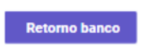

#  📄- Dashboard:
##  ⚙️ - Configuração:
    1.  Mensagem de "Bem-vindo" ao Sistema; 
    2.  Campo contadores;    
    3.  Graficos de Arrecadação; 
    4.  Processamento Banco Retorno;

 

#   
### ✅ - Campos: 

###  **📄 - Mensagem:**
        Bem-vindo ao sistema de Tributos Web!
        Aqui você encontra uma plataforma segura e eficiente para gerenciar seus tributos com facilidade. 
        Aproveite todos os recursos disponíveis e simplifique sua vida tributaria.

#

###   **🧮 - Campos contatdores:**

        1.  Contribuintes: Total de contribuintes cadastrados no sistema.
        2.  Mobiliário: Total de contribuinte CNPJ do município.
        3.  Profissional Liberal:  Total de Autônomo Informal cadastrado no sistema. 
        4.  Imobiliário:    Total de Imobiliário cadastrado no sistema.   

#   
###   **📊 - Arrecadação | Tributos:**  

**Explicação:**  
    **Grafico de barra:** _Basic Column Chart_  
        <https://react.spruko.com/spruha-js/preview/charts/apexchart/columnchart>  
        **Parametros:**  
        **- Y:** Valor Arrecadado total  
        **- X:** mês a mês : 

            1.  Janeiro;
            2.  Fevereiro;
            3.  Março;
            4.  Abril;
            5.  Maio;
            6.  Junho;
            7.  Julho;
            8.  Agosto;
            9.  Setembro;
            10. Outubro;
            11. Novembro;
            12. Dezembro;

            
**Barras:** Observação apenas sera dois anos, ano atual e ano anterior; 
    **Exemplo:** 2023 e 2024; 

**Filtro:** Trazer Contacontabil "Sigla" (tipo do tributo IPTU, TFF, ...), **modalidade pagamento = 01** ;   

#   
 

### **🦠- Processamento retorno banco:**   
**Explicação:**  
-   **Observação:** Trazer ultima data de credito processada no sistema; 

-   **Processamento Banco retorno:**

-   **🔗 - Data Credito:** Data de credito podendo pegar "atual" ou dias anteriores, filtro data; 
      
      
    **- Exemplo:**    
    
     
-   **🔗 - Campos da tabela:**    
  

    -   **Usuario:** Usuario processamento arquivo retorno;
    -   **Banco:**
    -   **Data processamento arquivo banco:**
    -   **NSA:**
    -   **Valor Recebido:** 
    -   **Valor Tarifa:**
    -   **Ações:** Funções da ação da lista de retorno dos bancos (View e imprimir); 
    -   **Total Recebido:**
    -   **Total tarifa:**

-   **🔗 - Retorno banco:**    
    

     

      
    **Observação:** Após processar, trazer arquivo retorno processado. Atualizando as informação da tela dashboard. 
<http://54.232.3.16/gestaotributaria/processamento/retornos-bancos>

    

#  🖼️ - Imagem Referencia: 
###   ✅ - Todos Tributos:
 

 

 **_Voltar menu:_** <https://github.com/VenturaCerqueira/Keep_Informatica/blob/main/README.mds>

 