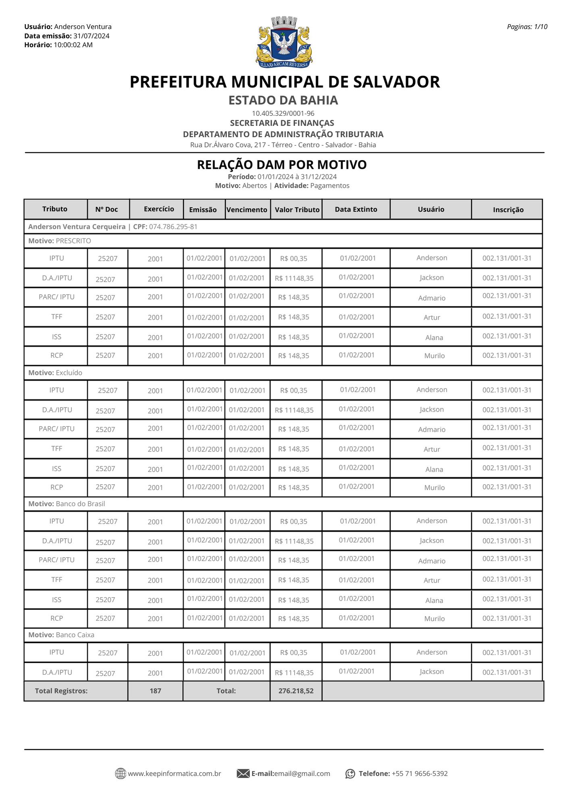
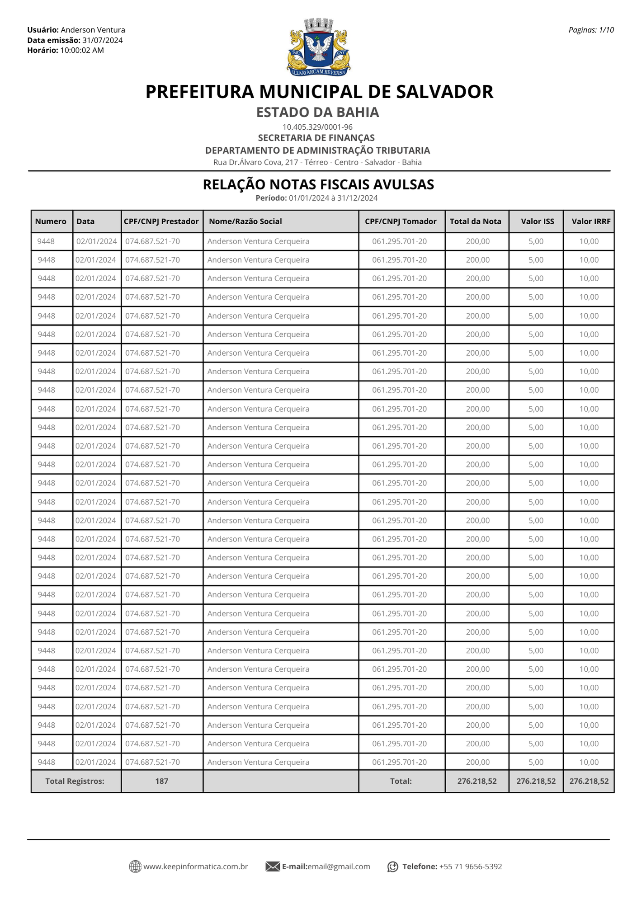

# Keep Informática
### Tributos WEB 

 ✅ - Este documento descreve o processo de geração, estrutura e funcionalidades do relatório do Sistema de Tributos Web. 
 ✅ - Explicação sober cada relatorio encontra-se nos **_links_** anexados. 

#  📄- Layout Relatorios:
**Explicação:** 
 <https://github.com/VenturaCerqueira/Keep_Informatica/blob/main/Documenta%C3%A7%C3%A3o/00%20-%20Layout%20paginas.md>
   _Link_ 

#    📄- Relatorios:

1.  **Relação de DAM's Emitidos:** 
    **_Explicação:_** 
    <https://github.com/VenturaCerqueira/Keep_Informatica/blob/main/Documenta%C3%A7%C3%A3o/01%20-%20Rela%C3%A7%C3%A3o%20de%20Documentos%20Emitidos.md>
     
    

2.  **Relação De DAM's Arrecadados:**  

    -   **Relação de DAM's Arrecadado Diario:** 
        **Explicação:** 
        <https://github.com/VenturaCerqueira/Keep_Informatica/blob/main/Documenta%C3%A7%C3%A3o/02.01%20-%20Relacao%20de%20DAM%20Arrecadados%20Diario.md>
         
        

    -   **Relação de DAM's Arrecadados:** 
    **_Explicação:_** 
        <https://github.com/VenturaCerqueira/Keep_Informatica/blob/main/Documenta%C3%A7%C3%A3o/02.02%20-%20Relacao%20de%20DAM%20Arrecadados.md> 
         

    -   **Relação de DAM's Arrecadados Analitico:** 
        **_Explicação:_**  
        <https://github.com/VenturaCerqueira/Keep_Informatica/blob/main/Documenta%C3%A7%C3%A3o/02.03%20-%20Analitico%20de%20DAM's%20Arrecadados.md>
         

3.  **Relação de Inadiplencia:** 
    **_Explicação:_** 
    <https://github.com/VenturaCerqueira/Keep_Informatica/blob/main/Documenta%C3%A7%C3%A3o/03%20-%20Rela%C3%A7%C3%A3o%20de%20inadiplencia.md>
     

4.  **Relação de DAM's por Motivo:** 
    **_Explicação:_** 
    <https://github.com/VenturaCerqueira/Keep_Informatica/blob/main/Documenta%C3%A7%C3%A3o/04%20-%20Rela%C3%A7%C3%A3o%20DAM%20por%20Motivo.md>
     
    
     

5.  **Relação de Adimplente:** 
    <https://github.com/VenturaCerqueira/Keep_Informatica/blob/main/Documenta%C3%A7%C3%A3o/05%20-%20Rela%C3%A7%C3%A3o%20de%20Adimplente.md>
     
    
     
    
6.  **Balancete no periodo:** 
    **_Explicação:_** 
    <https://github.com/VenturaCerqueira/Keep_Informatica/blob/main/Documenta%C3%A7%C3%A3o/07%20-%20Balancete%20no%20Periodo.md>
     
    
     

7.  **Relação de Nota Fiscais Avulsa:** 
    **_Explicação:_**  
    <https://github.com/VenturaCerqueira/Keep_Informatica/blob/main/Documenta%C3%A7%C3%A3o/08%20-%20Rela%C3%A7%C3%A3o%20de%20notas%20Fiscais%20Avulsas.md>
     
    
     

8.  **Listagem de Contribuinte:** 
    **_Explicação:_** 
    <https://github.com/VenturaCerqueira/Keep_Informatica/blob/main/Documenta%C3%A7%C3%A3o/09%20-%20Listagem%20de%20Contribuinte.md>
     
    

